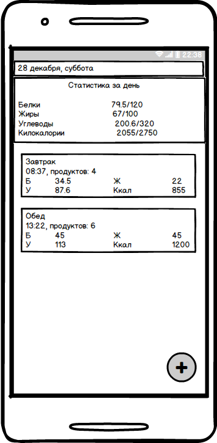
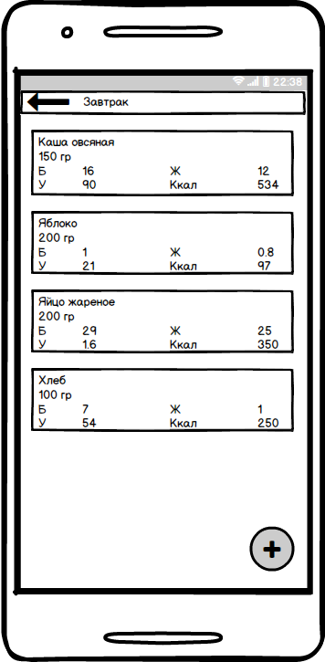
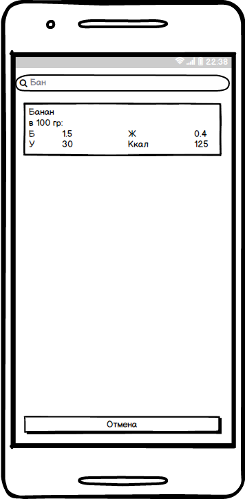
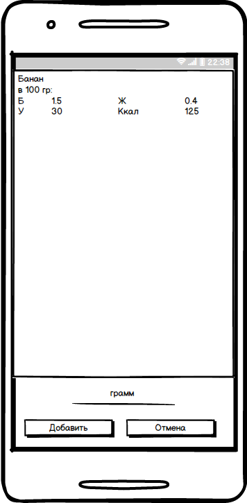
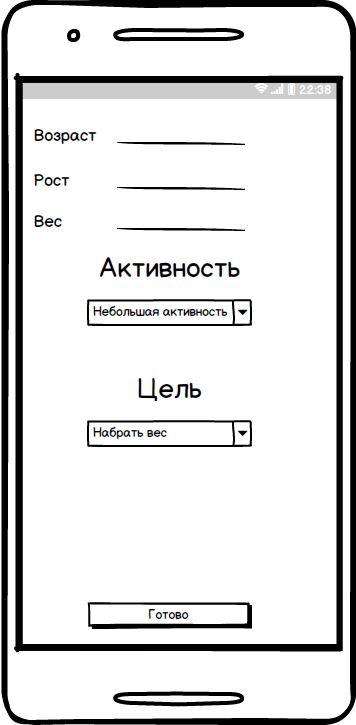

## Требования к проекту

### Содержание
1. [Введение](#intro) 
2. [Требования пользователя](#2) 
 2.1 [Программные интерфейсы](#2.1) 
 2.2 [Интерфейс пользователей](#2.2) 
 2.3 [Характеристики пользователей](#2.3) 
3. [Системные требования](#3) 
 3.1 [Функциональные требования](#3.1) 
 3.2 [Нефункциональные требования](#3.2) 
   3.2.1 [Атрибуты качества](#3.2.1) 
   3.2.2 [Ограничения](#3.2.2) 
4. [Аналоги](#4) 

### 1. Введение
Количество еды, употребляемое человеком, её качество и состав оказывают большое вляние на здоровье, самочувствие, когнитивные способности и жизнь человека в целом. Приложение KeepInFit помогает отслеживать количество употреблённых белков, жиров, углеводов и килокалорий за день. Эта информация очень полезна для всех категорий людей, независимо от того хотите ли вы похудеть, набрать массу или сохранить текущий вес.

### 2. Требования пользователей

#### 2.1 Программные интерфейсы
Приложение написано на Java, функционирует на базе платформы Android. Для получения информации о продуктах используется база данных, построенная на основе SQLite.
#### 2.2 Интерфейс пользователя

- Главная окно приложения

- Отображение приёма пищи 

- Поиск продукта

- Добавление продукта

- Данные пользователя

#### 2.3 Характеристики пользователей
Целевая аудитория проекта:
- Люди, желающие набрать массу или сбросить вес.
### 3. Системные требования
#### 3.1 Функциональные требования
Пользователю предоставлены следующие возможности:

| Функция | Требования | 
|:---|:---|
| Поиск продуктов | При вводе названия продукта отправляется запрос в базу данных. |
| Отображение информации о запрошенном продукте | Информация о продукте, полученная от базы данных, отображается в меню поиска. |
| Настройка информации о пользователе | Пользователь имеет возможность указать свои характеристики (рост, вес, уровень активности и т.д) для расчёта суточной нормы БЖУ и калорий. |
| Группировка продуктов по приёмам пищи | Продукты, употреблённые за один день можно группировать в отдельные приёмы пищи. |
| Взаимодействия с приёмами пищи | Пользователь может удалить, копировать, редактировать выбранный приём пищи. |

#### 3.2 Нефункциональные требования
##### 3.2.1 Атрибуты качества
Важными атрибутами качества проекта являются плавность работы интерфейса и его лаконичность. Также предпологается наличие обширной базы данных о продуктах.
##### 3.2.2 Ограничения
1. Устройство на Android 4.0 или выше.
#### 4.  Аналоги 
Существует множество аналогов разрабатываемого приложения, превосходящих его по функциональности ввиду наличия множества других функций. Основное преимущество приложения "KeepInFit" – наличие только основых функций, что облегчает пользование приложением.

-   [Health Diet](https://health-diet.ru/)
    -   Сайт, предоставляющий пользователю дневники питания и тренировок. Также содержит большую базу данных о продуктах, статьи и рецепты.
-   [Счетчик калорий и дневник тренировок XBodyBuild](https://play.google.com/store/apps/details?id=com.xbodybuild.lite&hl=ru)
    -   В приложении содержится счётчик калорий, дневник тренировок и программы тренировок.

